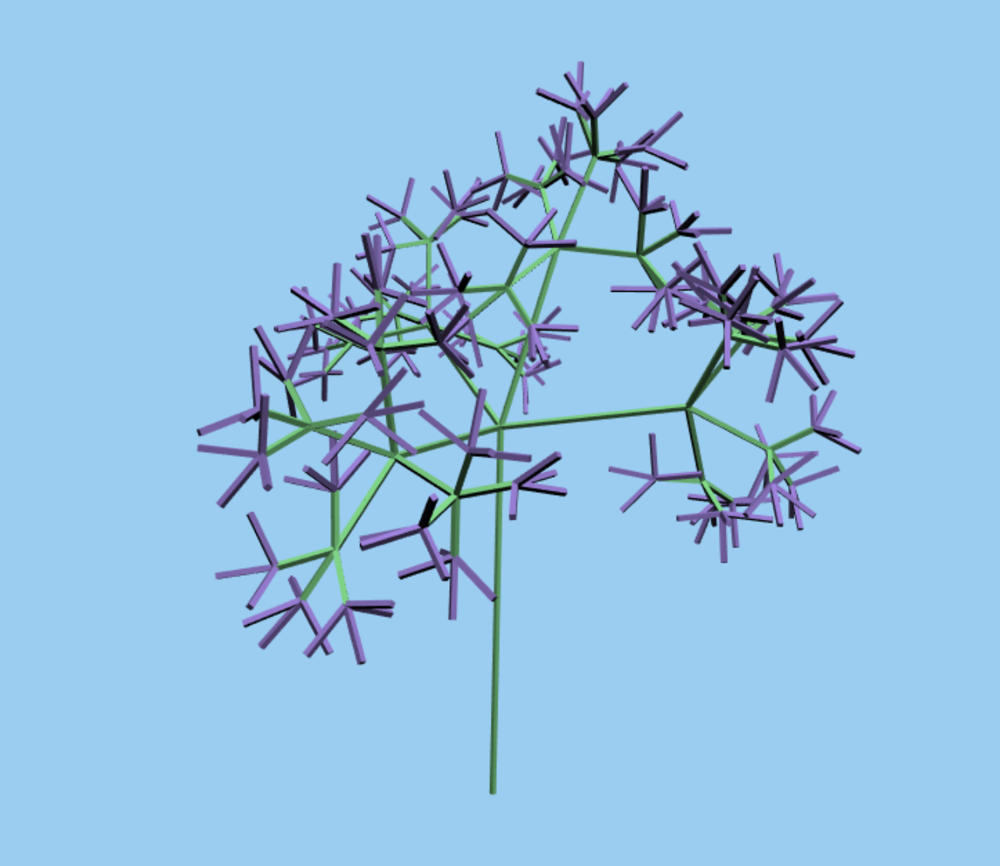

# Homework 4: L-systems

### Wenli Zhao

### wenliz

#### [demo](https://wpchop.github.io/homework-4-l-systems-wpchop/)

Here are some images generated from my l-system.

#### L-System
Here are the rules for generating the grammar:
"A" = "B[A][A][A]A"
"C" = "B[A][A]A"
"D" = "B[A][A][A][A]A"
"B" = "BB"

As for drawing it B represents branches and A represents leaves. C and D allow you to increase the initial sparsness of the lowest level of the tree. There is some randomness in the angles introduced when we parse a bracket in the grammar. This gives the l-system an organic look.

#### Interactivity
You can change the colors of the branches as well as the leaves. You can modify the input axiom. (Try D or A or BBC to start!)

Unfortunately, I ran out of time to do OBJ loading :(, so we have basic rectangular prisms for now. However, I think the basic-ness of the branch shapes works really well for 5 or 6 iterations! It's relatively fast and, at 5 or 6, iterations, generates interesting looking trees! 

#### Other technical details
I made a linkedlist to represent the lsystem axioms and efficiently create large grammars. The Lsystem class handles all the grammar construction. The turtle class handles all of the grammar parsing, and fills the buffers of a plant class, which inherits from the drawable class borrowed from earlier homeworks. In order to store transformations, I created a turtle state class and kept a "stack" of turtles. I used quaternions for rotation, and concatenated the translation, rotation, and scale matrices and applied the transformations to a base cube mesh and pushed the vertex data to arrays in the plant class.

Thanks for reading!
